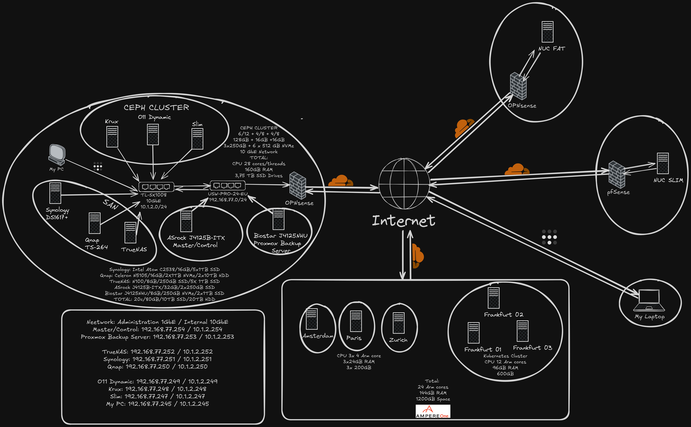

# Witaj na moim profilu GitHub!

**Mateusz Piekut**  
DevOps | Administrator Systemów Linux  
📍 Warka, Polska  
📫 Kontakt: [biuro@mateuszpiekut.pl](mailto:biuro@mateuszpiekut.pl)  
🔗 LinkedIn: [mateuszpiekut](https://www.linkedin.com/in/mateuszpiekut)

---

## 🔭 O mnie

Jestem doświadczonym specjalistą IT z pasją do wszystkiego, co związane z Linuxem, automatyzacją i DevOps. Przez ostatnie dwanaście lat rozwinąłem umiejętności, które pozwoliły mi projektować, wdrażać i zarządzać zaawansowanymi technologicznie infrastrukturami.

## 💼 Doświadczenie zawodowe

Moja droga do zostania specjalistą DevOps była wypełniona intensywnymi, samodzielnie zaplanowanymi tygodniami nauki i praktyki. Zacząłem od zrozumienia podstaw DevOps i Git, co umocniło moją wiedzę o ciągłej integracji i wersjonowaniu kodu. Zanurzyłem się w świat konteneryzacji, opanowując Docker i Docker Compose, które są kluczowe dla tworzenia elastycznych i skalowalnych środowisk.

Moje skupienie na sieciach i zabezpieczeniach zaowocowało zdolnością do zarządzania złożoną infrastrukturą sieciową i proxy odwrotnymi, a także konfiguracją VPN dla bezpiecznych połączeń. Moje doświadczenia z Traefik, Nginx Proxy Manager i zabezpieczeniami opartymi na CrowdSec uczyniły mnie biegłym w zapewnianiu niezawodności i bezpieczeństwa systemów.

## 🤖 Umiejętności AI i Automatyzacja No-Code

- **Sztuczna Inteligencja i Wielkie Modele Językowe (LLM)**: Biegłe wykorzystanie technologii AI i LLM do usprawniania procesów biznesowych i podejmowania decyzji. Aktywnie stosuję te modele do różnorodnych zastosowań, od automatyzacji pracy po pomoc osobistą.
- **Automatyzacja No-Code**: Znajomość platform no-code, takich jak Make (dawniej Integromat), umożliwiająca automatyzację przepływów pracy i integrację usług bez tradycyjnego kodowania. To podejście znacznie zwiększyło efektywność i pozwoliło na kreatywne rozwiązania w zarządzaniu projektami i codziennych zadaniach.

## 🌱 Aktualnie uczę się

- **Kubernetes & Integracja CI/CD**: Aktywnie uczę się Kubernetes, integrując go z wiedzą o CI/CD za pomocą Jenkins i Argo CD, oraz rozwijam umiejętności automatyzacji z Ansible. Ta część mojej podróży DevOps podkreśla naukę i rozwój.
- **Bezpieczeństwo IT**: Badam najlepsze praktyki zarządzania certyfikatami SSL/TLS i konfiguracjami firewalli.

## 📸 Mój HomeLab

Oto wizualizacja mojego home laba:

  

## 👯 Otwarty na współpracę

Chętnie podejmę współpracę nad projektami związanymi z rozwojem narzędzi open source do zarządzania infrastrukturą oraz innowacyjnymi projektami w dziedzinie automatyzacji i zarządzania konfiguracją.

## 💬 Zapytaj mnie o

Zapraszam do zadawania pytań na temat Linuxa, automatyzacji i technologii chmurowych lub o porady dotyczące kariery w IT i rozwoju umiejętności technicznych.

## 📣 Portfolio

- **Moja strona internetowa:** [mateuszpiekut.pl](https://mateuszpiekut.pl)
- **Strona pracy:** [pcmagik.pl](https://pcmagik.pl)
- **Media społecznościowe:** [Facebook - PCmagik](https://pl-pl.facebook.com/PCmagik), [YouTube - PC Magik Home Lab](https://www.youtube.com/c/PCMagikHomeLab), [Discord - PC Magik](https://discord.gg/FqS6pAmd5M)

Dziękuję za odwiedziny mojego profilu GitHub. Zapraszam do eksploracji moich repozytoriów i nie wahaj się skontaktować. Razem uczynimy świat kodowania lepszym, linijka po linijce! ✨

## Statystyki

---
## Buy me a coffee ☕

[🇬🇧 English version of this file](README.md)
